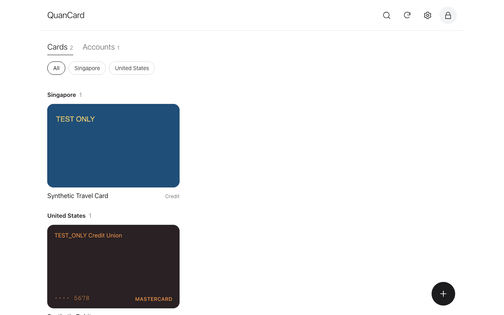
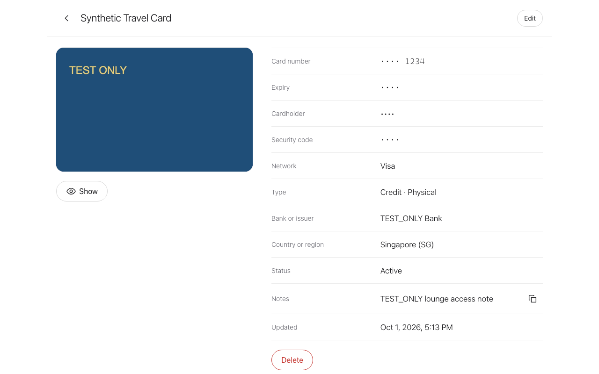
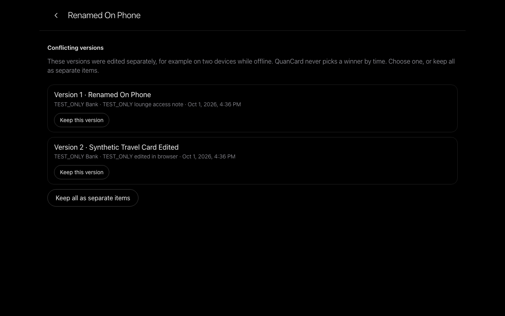
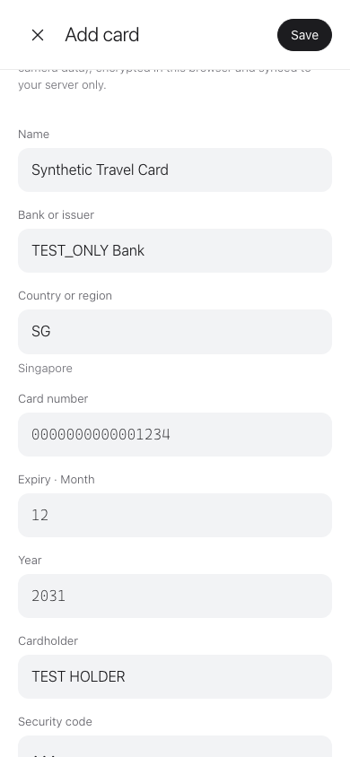
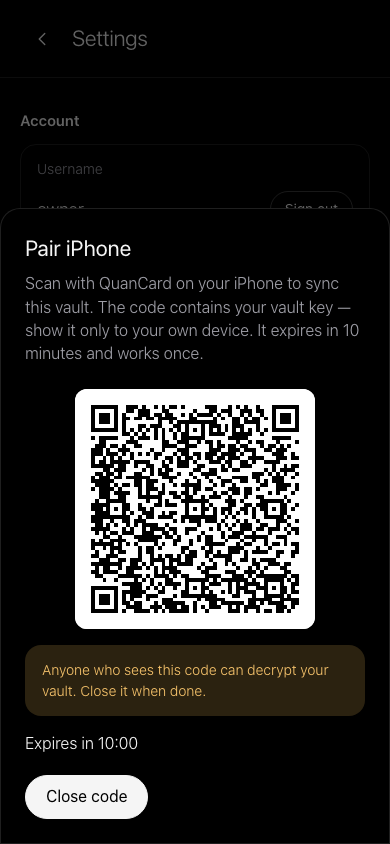

<p align="center">
  
</p>

<h1 align="center">QuanCard Server</h1>

<p align="center">
  Self-hosted, zero-knowledge sync and web vault for <a href="https://quancard.app">QuanCard</a> —
  keep your own payment cards and bank-account details on a server you control.
</p>

<p align="center">
  <a href="LICENSE"></a>
  
  
  <a href="README.zh-CN.md"></a>
</p>

> [!IMPORTANT]
> QuanCard is a **personal vault**. It does not issue cards, move money, connect to banks, or help
> anyone bypass KYC or regional restrictions. This is a 0.1 development preview without an
> independent security audit — read the [threat model](THREAT_MODEL.md) before storing real data.

## Why

QuanCard on iPhone keeps your cards locally and can sync through iCloud. Some people would rather
not depend on any vendor cloud. QuanCard Server lets you run the sync backend yourself — and adds a
web client to browse, add and edit cards from any desktop browser — **without the server ever being
able to read your data**.

## Features

| | |
| --- | --- |
| 🔐 **Zero-knowledge** | Everything is encrypted in your browser (or iPhone) with AES-256-GCM before upload. The server stores opaque ciphertext only. |
| 🔑 **Password never leaves the browser** | Argon2id (64 MiB) + HKDF. The server only verifies a derived key and cannot reset or recover your password. |
| 🌐 **HTTPS by default** | One `docker compose up` with automatic Let's Encrypt certificates. Plain HTTP is refused. |
| 💳 **Cards and accounts on the web** | Add, edit, delete, search, region filters, favourites, card photos, global routing details (IBAN, SWIFT/BIC, ABA, …). |
| 🙈 **Masked by default** | Card numbers show the last four digits; expiry, cardholder and CVC need your password again. Auto-lock after 5 minutes idle. |
| 🔀 **Honest conflict handling** | Same immutable revision protocol as the iPhone app. Concurrent edits are shown side by side — time never silently picks a winner. |
| 📱 **iPhone pairing** | One-time QR code (10 minutes, single use) hands the vault key to your phone; the server never sees it. |
| 👨‍👩‍👧 **Family-ready** | Owner invites members; each has a separate, separately-encrypted vault. |
| 🛡️ **Hardened** | TOTP 2FA, rate limits, lockout, append-only audit log, strict CSP, non-root read-only container, no telemetry. |

## Quick start

You need a Linux host with Docker, a domain pointing to it, and ports 80/443 open.

```sh
git clone https://github.com/zoolapp/quancard-server.git && cd quancard-server
./scripts/init-env.sh vault.example.com
docker compose up -d --wait
```

Open `https://vault.example.com`, enter the setup token printed above, and create the owner account.
Just trying it out? `./scripts/init-env.sh localhost && docker compose -f compose.local.yaml up -d`,
then open <http://localhost:8080>.

Behind your own nginx / Traefik / Cloudflare Tunnel, backups, upgrades and every configuration
option: **[Deployment guide](docs/deployment.md)**.

## How it works

```text
 Browser / iPhone (trusted)                              Your server (untrusted for content)
 ─────────────────────────                              ───────────────────────────────────
 password ─Argon2id─▶ authKey ─────────────────────────▶ Argon2id(authKey) verifier
                    └▶ KEK ─wraps─▶ Account Key ──────────▶ wrapped Account Key
                                     └─wraps─▶ vault key ─▶ wrapped vault key
 card / account ─AES-256-GCM(vault key)─▶ revision ─────▶ opaque, immutable revisions
```

- **Protocol compatibility.** The web client speaks the iPhone app's `quancard.envelope.v1` and
  sync v1 formats and reproduces the iOS test vectors byte for byte
  ([`vectors/`](vectors/SOURCES.md), [`packages/protocol`](packages/protocol)).
- **Card photos** are re-encoded in the browser (EXIF stripped, ≤ 1600 px, ≤ 1 MiB), encrypted, and
  travel inside the item's revision. They go to your server and your paired devices — nowhere else.
- **Adding cards on the web** is fully supported: new items are ordinary sync revisions, validated by
  the same strict codec the iPhone uses, so they appear on paired devices like any other change.

Specifications: [auth v1](docs/protocol/auth-v1.md) · [pairing v1](docs/protocol/pairing-v1.md) ·
[sync v1 data plane](docs/protocol/sync-v1.md) · [HTTP API (OpenAPI)](docs/protocol/openapi.yaml).

## Security model in one paragraph

A stolen database, backup or network capture reveals no card data; a weak password can still be
guessed offline, so use a long passphrase. The server operator sees metadata (account names, how many
revisions, when). **A malicious or compromised server could serve modified web code** — the limit of
every browser-based E2EE app — so run the server yourself, keep it updated, and prefer the iPhone app
on hosts you do not trust. Details and mitigations: [THREAT_MODEL.md](THREAT_MODEL.md). Report
vulnerabilities privately: [SECURITY.md](SECURITY.md).

## Screenshots

| Light | Dark |
| --- | --- |
|  |  |
|  |  |

All screenshots use synthetic test data.

## Project status

| Area | Status |
| --- | --- |
| Server: accounts, 2FA, invites, sessions, audit, vault data plane, pairing | ✅ implemented, tested |
| Web client: setup, sign-in, vault CRUD, photos, reveal, conflicts, settings | ✅ implemented, end-to-end tested |
| Docker image, HTTPS compose, backup/restore | ✅ verified locally |
| iPhone app self-hosted sync (scan pairing QR) | 🚧 specified ([pairing v1](docs/protocol/pairing-v1.md)), app update pending |
| `.qvault` import/export in the browser, WebAuthn, reproducible-build hashes | 🗓 planned |
| Independent security audit | 🗓 planned |

## Development

```sh
corepack enable && pnpm install
pnpm -r build
pnpm -r test                 # protocol vectors + server tests
pnpm exec playwright test    # end-to-end story against a real server + built web client
pnpm lint
```

Layout: `packages/protocol` (Apache-2.0, isomorphic codecs) · `apps/server` (Fastify, `node:sqlite`) ·
`apps/web` (Preact, WebCrypto, hash-wasm) · `e2e` · `deploy`. Contribution guidelines:
[CONTRIBUTING.md](CONTRIBUTING.md).

## License

Server and web client: [AGPL-3.0-only](LICENSE). `packages/protocol` and `vectors/`:
[Apache-2.0](packages/protocol/LICENSE), so other clients and auditors can reuse them freely.
© 2026 ZOOL LLC.
