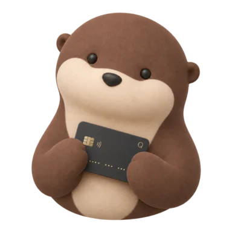
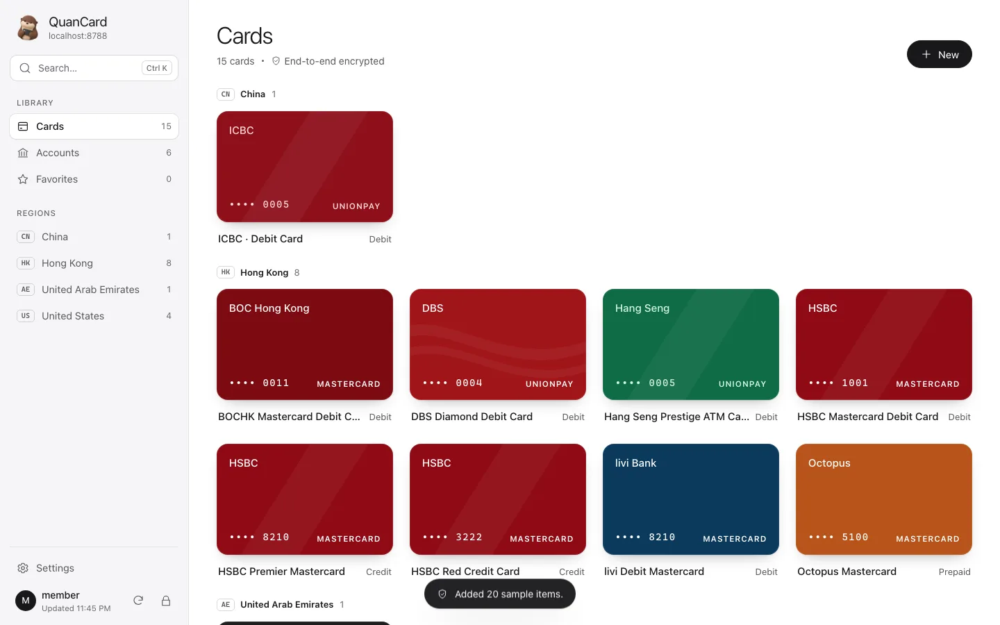
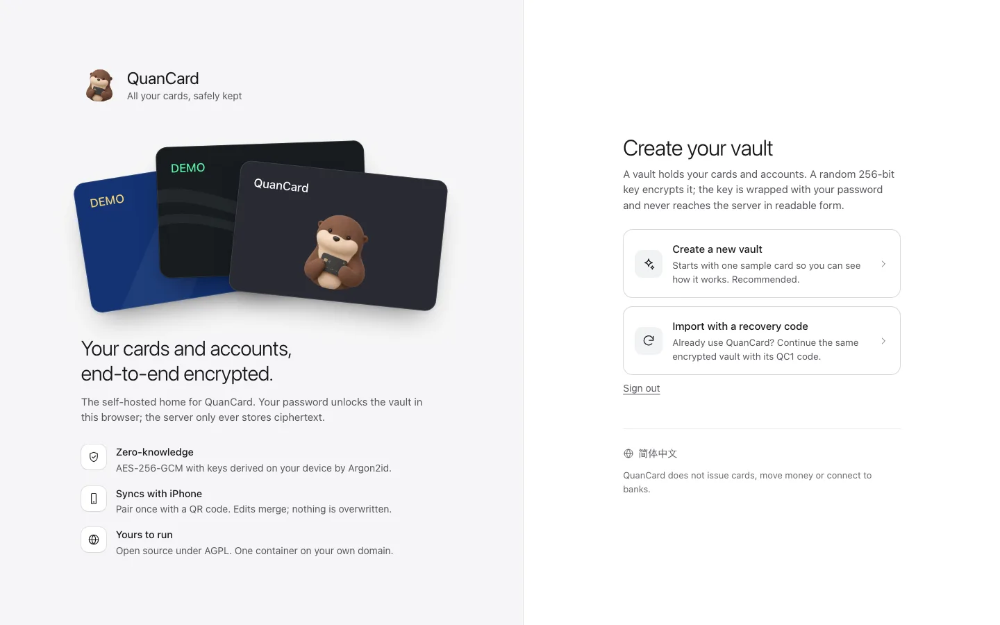
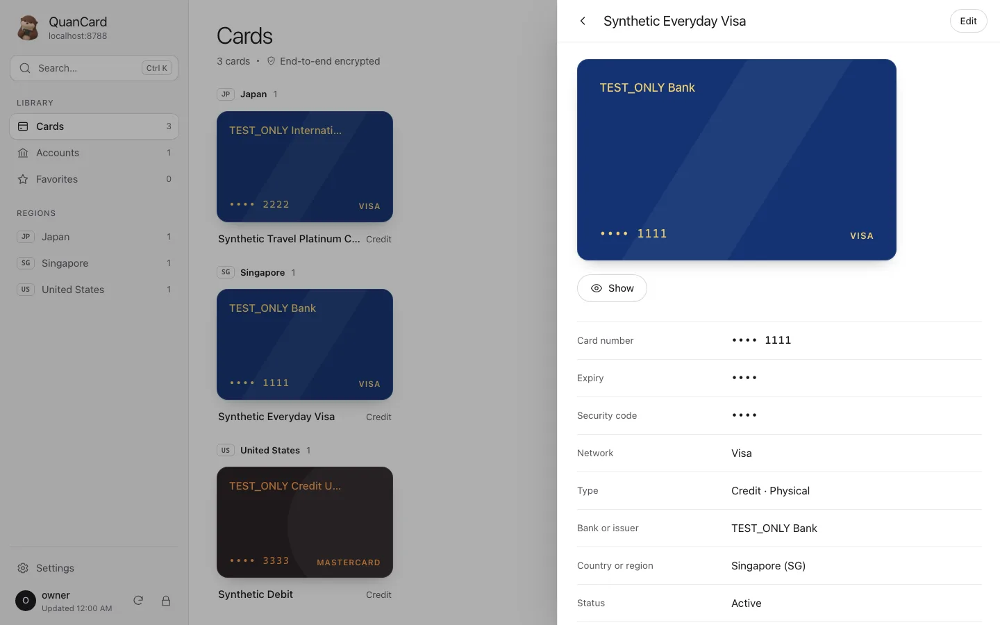
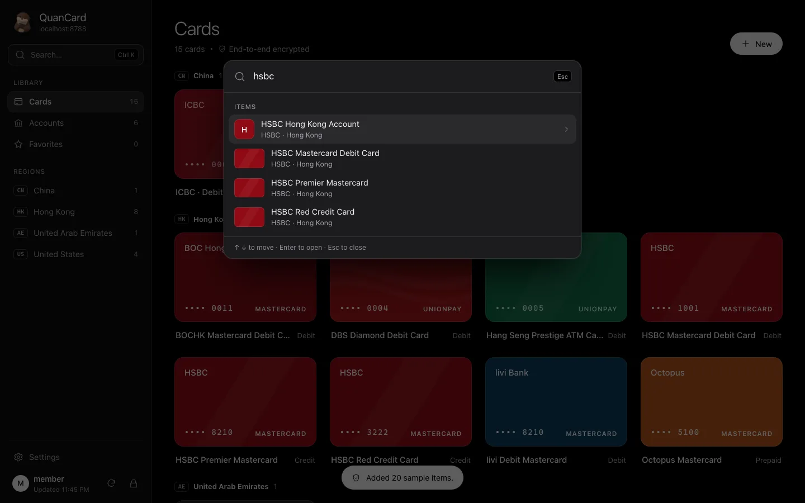
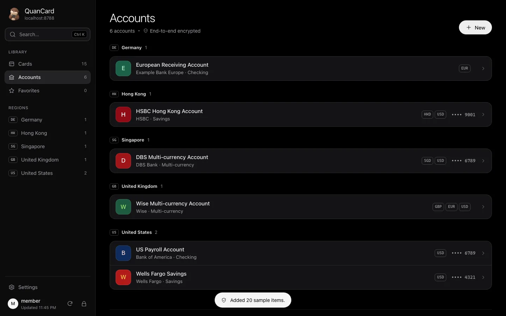
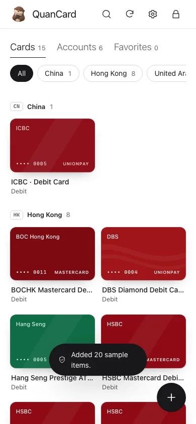
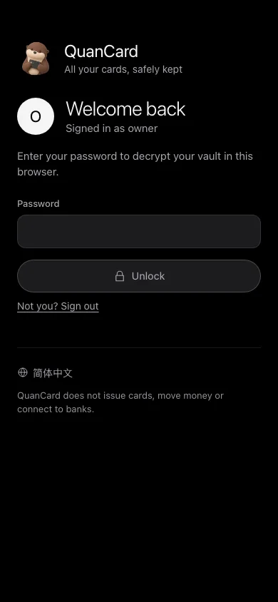

<p align="center">
  
</p>

<h1 align="center">QuanCard Server</h1>

<p align="center">
  <strong>Your cards and bank accounts, synced between your devices, on a server only you control.</strong><br />
  The self-hosted, zero-knowledge sync service and web vault for <a href="https://quancard.app">QuanCard</a>.
</p>

<p align="center">
  <a href="LICENSE"></a>
  
  
  
  <a href="README.zh-CN.md"></a>
</p>

<p align="center">
  <a href="https://quancard.app/server/">Website</a> ·
  <a href="docs/guide/getting-started.md">Getting started</a> ·
  <a href="docs/deployment.md">Deployment</a> ·
  <a href="THREAT_MODEL.md">Threat model</a> ·
  <a href="docs/protocol/">Protocols</a>
</p>

<p align="center">
  
</p>

> [!IMPORTANT]
> QuanCard is a **personal collection vault**. It does not issue cards, move money, connect to
> banks or help anyone bypass KYC or regional restrictions. This is a **development preview**
> without an independent security audit. Read the [threat model](THREAT_MODEL.md) before you store
> real data.

## What it is

QuanCard on iPhone keeps your cards and bank accounts on the device and can sync through iCloud.
QuanCard Server is the third option: **your own sync backend**, plus a full **web vault** for any
desktop browser. It stays out of your data:

- **iPhone ⇄ server ⇄ web.** Pair your iPhone once with a QR code. Edits on either side appear on
  the other, encrypted end to end.
- **Zero knowledge.** The browser and the iPhone encrypt everything before upload. The server
  stores opaque, immutable revisions and never sees a card number, a key or your password.
- **Yours to run.** One Docker Compose file with automatic HTTPS, your domain, your backups. Open
  source under AGPL-3.0.

## Highlights

<table>
<tr>
<td width="50%" valign="top">

**🔐 End-to-end encrypted**<br />
AES-256-GCM per item, keys derived with Argon2id (64 MiB) in the browser. The server verifies a
derived key and cannot reset or recover your password.

**📱 Multi-device sync**<br />
The same revision protocol as the iPhone app, byte-for-byte compatible with its test vectors.
Changes from your phone show up in the browser on their own: when the tab regains focus, and
every 60 seconds while it is open.

**🔗 One-scan pairing**<br />
A single-use QR code hands the vault key to your iPhone. The browser confirms the moment the phone
connects and follows its first sync. Both screens play the same "linked" animation.

**🔀 Conflicts you can trust**<br />
No device clock ever silently picks a winner. Identical copies, for example from a re-paired phone,
are folded automatically. Real differences go to a conflict centre with a field-by-field comparison
and confirmed bulk actions.

</td>
<td width="50%" valign="top">

**💳 A real desktop app**<br />
Sidebar navigation by region and favourites, ⌘K command palette, side-sheet details, issuer card
colours matching the iPhone, photos re-encoded in the browser, and global routing details (IBAN,
SWIFT/BIC, ABA, sort code…).

**🙈 Private by default**<br />
Card numbers show the last four digits. Expiry, cardholder and CVC need your password again.
Configurable auto-lock, a lock 60 s after the tab goes to the background, and a privacy cover in
task switchers.

**👨‍👩‍👧 Family-ready**<br />
The owner invites members. Each member has a separate account and a separately encrypted vault;
the owner cannot read it.

**🛡️ Hardened**<br />
TOTP two-step verification with recovery codes, rate limits and lockout, an append-only audit log,
a strict CSP, a non-root read-only container, and no telemetry.

</td>
</tr>
</table>

## Quick start

You need a Linux host with Docker, a domain that points to it, and ports 80 and 443 open.

```sh
git clone https://github.com/zoolapp/quancard-server.git && cd quancard-server
./scripts/init-env.sh vault.example.com      # writes .env and prints a one-time setup token
docker compose up -d --wait                  # Caddy obtains the HTTPS certificate
```

1. Open `https://vault.example.com`, enter the setup token and create the owner account.
2. Create a vault. It starts with a sample card; Settings → Sample data loads the full catalogue.
3. Settings → **Pair iPhone**, then scan the code in QuanCard: Settings → Sync → Self-hosted Sync.

To try it on your own machine, run `./scripts/init-env.sh localhost && docker compose -f compose.local.yaml up -d`,
then open <http://localhost:8080>.

📖 **[Getting started](docs/guide/getting-started.md)** walks through the first hour: pairing,
members, two-step verification and backups. **[Deployment](docs/deployment.md)** covers nginx,
Traefik and Cloudflare Tunnel, upgrades, and every configuration option.

## Screenshots

| | |
| --- | --- |
|  |  |
|  |  |
|  |  |

All screenshots use synthetic test data or the built-in sample data (public test numbers that
cannot make payments).

## How it works

```text
 Browser / iPhone (trusted)                                Your server (untrusted for content)
 ──────────────────────────                                ───────────────────────────────────
 password ─Argon2id─▶ authKey ───────────────────────────▶ Argon2id(authKey) verifier
                   └▶ KEK ─wraps─▶ Account Key ───────────▶ wrapped Account Key
                                    └─wraps─▶ vault key ──▶ wrapped vault key
 card / account ─AES-256-GCM(vault key)─▶ revision ───────▶ opaque, immutable revisions
 iPhone ◀── one-time QR code (vault key, never sent to the server) ── browser
```

- **One protocol, every client.** The web client speaks the iPhone's `quancard.envelope.v1` and
  sync v1 formats and reproduces the iOS test vectors byte for byte
  ([`vectors/`](vectors/SOURCES.md), [`packages/protocol`](packages/protocol), Apache-2.0).
  Future clients such as macOS discover server features from `GET /api/v1/status`.
- **Photos** are re-encoded in the browser (EXIF stripped, ≤ 1600 px, ≤ 1 MiB), encrypted, and
  stored inside the item's revision. They reach your server and your paired devices only.
- **Sample data** uses the same catalogue and item IDs as the iPhone app, so a sample loaded on one
  device is recognised, and can be removed, on the others.

Specifications: [auth v1](docs/protocol/auth-v1.md) · [pairing v1](docs/protocol/pairing-v1.md) ·
[sync v1](docs/protocol/sync-v1.md) · [HTTP API (OpenAPI)](docs/protocol/openapi.yaml) ·
[passkey v1 (proposal)](docs/protocol/passkey-v1.md).

## Security model in brief

A stolen database, backup or network capture reveals no card data. A weak password can still be
guessed offline, so use a long passphrase. The server operator sees metadata: account names, how
many revisions there are and when they were written. **A malicious or compromised server could
serve modified web code**, which is the limit of every browser-based end-to-end encrypted app. Run
the server yourself, keep it updated, and prefer the iPhone app on hosts you do not trust. Details
and mitigations are in [THREAT_MODEL.md](THREAT_MODEL.md). Report vulnerabilities privately as
described in [SECURITY.md](SECURITY.md).

## Project status

| Area | Status |
| --- | --- |
| Server: accounts, 2FA, invites, sessions, audit, vault data plane, pairing, capability discovery | ✅ implemented, tested |
| Web vault: desktop shell, ⌘K, cards and accounts, photos, reveal, conflict centre, sample data, PWA | ✅ implemented, end-to-end and UI-gate tested |
| iPhone self-hosted sync: QR pairing, linked animation, identical-copy folding | ✅ implemented in the app (pending App Store release) |
| Docker image, HTTPS compose, backup and restore | ✅ verified |
| Passkeys (PRF unlock) | 📝 [specified and reviewed](docs/protocol/passkey-v1.md), not implemented |
| Encrypted `.qvault` import/export in the browser, macOS client, sync v2 (photo blobs) | 🗓 [roadmap](docs/roadmap-multi-platform.md) |
| Independent security audit | 🗓 planned |

## Development

```sh
corepack enable && pnpm install
pnpm -r build && pnpm -r test && pnpm lint
pnpm exec playwright test e2e/vault.spec.ts                         # end-to-end story
UI_ACCEPTANCE=1 pnpm exec playwright test e2e/ui-acceptance.spec.ts # UI gate (run separately)
```

Layout: `packages/protocol` (Apache-2.0, isomorphic codecs) · `apps/server` (Fastify, `node:sqlite`) ·
`apps/web` (Preact, WebCrypto, hash-wasm) · `e2e` · `deploy`. See
[CONTRIBUTING.md](CONTRIBUTING.md) and [CHANGELOG.md](CHANGELOG.md).

## License

The server and the web client are licensed under [AGPL-3.0-only](LICENSE). `packages/protocol` and
`vectors/` are licensed under [Apache-2.0](packages/protocol/LICENSE), so other clients and
auditors can reuse them freely. The QuanCard name, the otter character and the app icon are brand
assets of ZOOL LLC ([details](apps/web/src/assets/SOURCES.md)). © 2026 ZOOL LLC.
